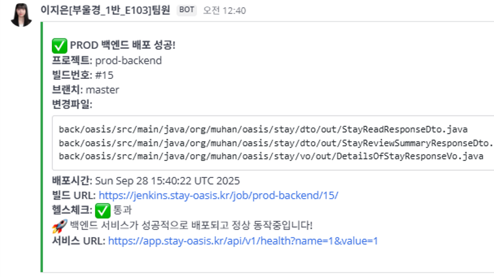
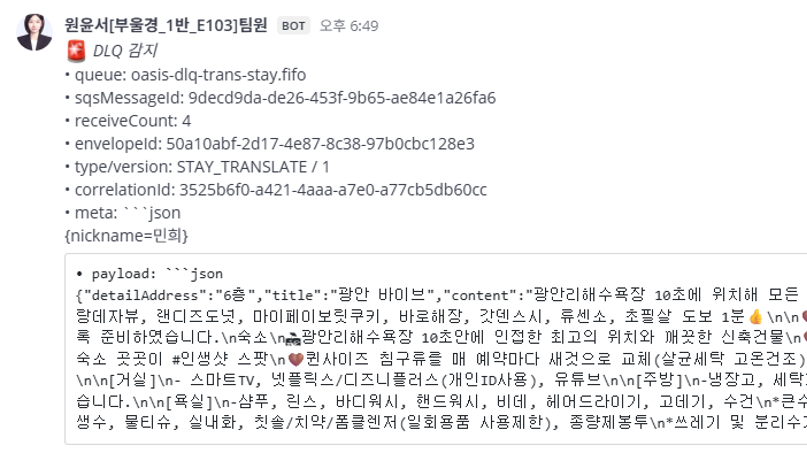
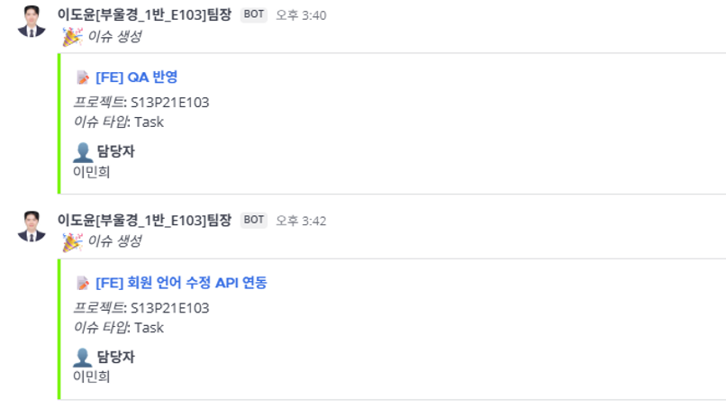
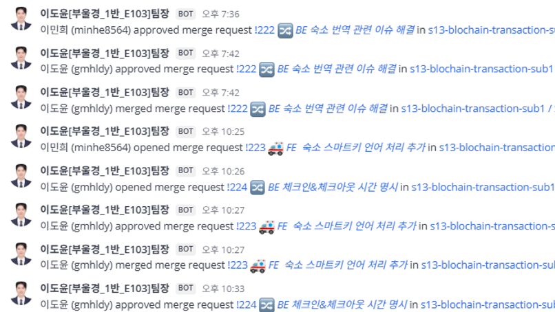

<div align="center">

# 🏠 oasis

</div>

**블록체인 기반 P2P** 숙박 예약 플랫폼<br>
**스마트 계약(Smart Contract)**을 통해 신뢰 없이 투명한 거래를 보장하고,
디지털 키 발급 및 결제 내역을 온체인(On-chain)으로 관리하여,
중개 수수료 없이 게스트와 호스트가 직접 연결되는 탈중앙화 숙박 예약 서비스를 제공합니다.

> 머무는 순간까지, 여행이니까 **oasis**

- **개발 기간** : 2025.08.25 ~ 2025.09.29 **(6주)**
- **플랫폼** : PWA Web & Mobile
- **개발 인원** : 6명
- **기관** : 삼성 청년 SW·AI 아카데미 13기 <br><br>

<!--  -->

</div> <br>

## 🔎 목차

<div align="center">

### <a href="#developers">🌴 팀원 소개</a>

### <a href="#techStack">🛠️ 기술 스택</a>

### <a href="#systemArchitecture">🌐 시스템 아키텍처</a>

### <a href="#skills">📲 기능 구성</a>

### <a href="#directories">📂 디렉터리 구조</a>

### <a href="#projectDeliverables">📦 프로젝트 산출물</a>

</div>
<br>

## 🌴 팀원 구성

<a name="developers"></a>

<div align="center">

<div align="center">
<table>
    <tr>
        <td width="33%" align="center"> <a href="https://github.com/gyudol">
             <br> 이도윤 <br>[Backend · Leader] </a> <br></td>
        <td width="33%" align="center"> <a href="https://github.com/minhe8564">
             <br> 이민희 <br>[Frontend · BlockChain] </a> <br></td>
        <td width="33%" align="center"> <a href="https://github.com/0w0n2">
             <br> 김수민 <br>[Frontend · 
Presentation] </a> <br></td>
    </tr>
    <tr>
      <td width="280px">
        <sub>
          - Security, OAuth2, SMTP 기반 인증 API 구현 <br>
          - 숙소 예약 API 구조 설계 <br>
          - Swagger / API 명세서 문서화 관리 <br>
          - 프로젝트 총괄 및 일정 관리 담당
        </sub>
      </td>
      <td width="280px">
        <sub>
          - Next.js + TypeScript + PWA 기반 Web / Mobile App 개발 <br>
          - Polygon 트랜잭션 처리 및 비동기 흐름 최적화 <br>
          - UI/UX 설계 및 반응형 컴포넌트 구현 <br>
          - 상태관리(Zustand) + React Query 캐싱 아키텍처 설계
        </sub>
      </td>
      <td width="280px">
        <sub>
          - Firebase 연동 및 설정 <br>
          - Cloud Firestore 기반 실시간 채팅 구현 <br>
          - UI 구성 정리 및 사용자 피드백 기반 개선 작업 <br>
          - 프로젝트 발표
        </sub>
      </td>
    </tr>

</table>

<table>
    <tr>
        <td width="33%" align="center"> <a href="https://github.com/jieun-99">
         <br> 김지은 <br>[Infra · IoT] </a> <br></td>
        <td width="33%" align="center"> <a href="https://github.com/yoonsu0325">
         <br> 원윤서 <br>[Backend · Async API] </a> <br></td>
        <td width="33%" align="center"> <a href="https://github.com/yuju9">
         <br> 이아현 <br>[Backend · BlockChain] </a> <br></td>
    </tr>
    <tr>
        <td width="280px">
          <sub>
            - CI/CD 파이프라인 구축 / 배포 자동화 <br>
            - AWS Cloud 환경 세팅 <br>
            - HW ESP32 ↔ EC2 통신 연동 / IoT 테스트 환경 구성 <br>
            - 빌드 / 배포 안정성 및 서버 성능 최적화
          </sub>
        </td>
        <td width="280px">
          <sub>
            - 숙소 관련 도메인 설계 및 비지니스 로직 구현<br>
            - 비동기 메시징 / 아키텍처 구축 <br>
            - AI 리뷰 요약 / 번역 기능 구현 <br>
            - 비동기 API 구조 및 데이터 파이프라인 개선
          </sub>
        </td>
        <td width="280px">
          <sub>
            - Solidity 기반 스마트 컨트랙트 설계 <br>
            - Circle Web3 Service 활용 USDC 결제 시스템 구축 <br>
            - Polygon 네트워크 연동 <br>
            - 온체인 데이터 정합성 검증 및 운영 자동화
          </sub>
        </td>
    </tr>

</table>
</div>
<br>

</div>

## 🛠️ 기술 스택

<a name="techStack"></a>

---

### 🌕 Frontend

<div align="center">

<br>


<br>


<br>

| **Category**             | **Stack**                                                                   |
| :----------------------- | :-------------------------------------------------------------------------- |
| **Language**             | TypeScript 5.4.5                                                            |
| **Runtime Environment**  | Node.js 22.12.0 (PWA 기반)                                                  |
| **Framework**            | Next.js 15.5.2, React 18.3.1 (App Router)                                   |
| **Styling**              | TailwindCSS 3.4.13, Emotion 11.14.0, Framer Motion 12.23.12                 |
| **State / Data**         | Zustand 5.0.8, TanStack React Query 5.87.1                                  |
| **Form / Validation**    | React Hook Form 7.62.0, Zod 3.23.8, @hookform/resolvers 3.10.0              |
| **Network / Auth**       | Axios 1.11.0, Firebase Auth 12.2.1, JWT Decode 4.0.0                        |
| **UI / Animation**       | Swiper 12.0.2, Lottie-web 5.13.0, Lucide-react 0.542.0, Emoji Picker 4.13.3 |
| **Blockchain / Payment** | @circle-fin/w3s-pw-web-sdk 1.1.11 (USDC 결제 처리)                          |
| **Build / PWA**          | next-pwa 5.6.0, Babel Loader 10.0.0                                         |
| **IDE**                  | Visual Studio Code 1.103.1                                                  |

</div>

---

### 🌑 Backend

<div align="center">


<br>


<br>


<br>

| **Category**   | **Stack**                                                                                                                                                                                                                                                             |
| :------------- | :-------------------------------------------------------------------------------------------------------------------------------------------------------------------------------------------------------------------------------------------------------------------- |
| **Language**   | Java 17                                                                                                                                                                                                                                                               |
| **Framework**  | Spring Boot 3.3.4                                                                                                                                                                                                                                                     |
| **Build Tool** | Gradle 8.14.3                                                                                                                                                                                                                                                         |
| **Libraries**  | Spring Security, Spring Validation, Spring Data JPA, QueryDSL, Spring Data Redis, Spring Batch, WebSocket, WebFlux, Quartz Scheduler, jjwt 0.12.3, OAuth2 Client (Google), Springdoc OpenAPI 2.6.0, AWS SDK v2 (S3, SQS), MQTT (Eclipse Paho 1.2.5), OpenAI Proxy API |
| **Database**   | MySQL 8.0.11 (mysql-connector-j), Redis 7.4.5                                                                                                                                                                                                                         |
| **Blockchain** | Web3j Core / Contracts / Utils                                                                                                                                                                                                                                        |
| **Messaging**  | AWS SQS, MQTT                                                                                                                                                                                                                                                         |
| **Storage**    | AWS S3 (Transfer Manager)                                                                                                                                                                                                                                             |
| **Monitoring** | Mattermost Webhook, Spring Actuator                                                                                                                                                                                                                                   |
| **Docs**       | Swagger UI (springdoc-openapi-starter-webmvc-ui 2.6.0)                                                                                                                                                                                                                |
| **IDE**        | IntelliJ IDEA 2025.1.3 (Ultimate Edition)                                                                                                                                                                                                                             |

</div>

---

### ⚙️ Infra / DevOps

### ⚙️ Infra / DevOps

<div align="center">


<br>


<br>


<br>

| **Category**               | **Stack**                                                                                  |
| :------------------------- | :----------------------------------------------------------------------------------------- |
| **Infra**                  | AWS EC2 (Ubuntu 22.04 LTS), AWS S3                                                         |
| **CI/CD**                  | Jenkins **2.516.2**, Docker **28.1.1**, Docker Compose **2.38.2**                          |
| **Web / Proxy**            | Nginx **1.27**                                                                             |
| **MQTT Broker**            | Mosquitto **2.0.22**                                                                       |
| **Monitoring**             | Grafana **10.4.2**, Prometheus **v2.54.1**, Node Exporter **v1.9.1**, cAdvisor **v0.53.0** |
| **Version Control / Auth** | GitLab                                                                                     |
| **Server Spec**            | 4 vCPUs / 16 GB RAM / SSD 320 GB / HDD 6 TB                                                |

</div>

---

### 🔌 IoT

<div align="center">


<br>

| **Category** | **Stack**                       |
| :----------: | :------------------------------ |
| **Hardware** | Arduino, ESP32                  |
| **Language** | C / C++                         |
|  **Module**  | Servo Motor (Door Lock Control) |

</div>

---

### 🤝 Collaboration

<div align="center">


</div>
<br>

## 🌐 시스템 아키텍처

<a name="systemArchitecture"></a>

### 🖧 System Architecture

<div align="center">


</div>

### 📢 Collaboration & Event Notification

<div align="center">

<table>
  <tr>
    <td align="center" width="50%"><b>🧩 Jenkins Pipeline</b></td>
    <td align="center" width="50%"><b>🧠 DLP Process</b></td>
  </tr>
  <tr>
    <td align="center">
      
    </td>
    <td align="center">
    
    </td>
  </tr>
  <tr>
    <td align="center" width="50%"><b>🗨️ Jira Issue Created</b></td>
    <td align="center" width="50%"><b>🔀 Merge Request Notification</b></td>
  </tr>
  <tr>
    <td align="center">
      
    </td>
    <td align="center">
      
    </td>
  </tr>
</table>

</div>

<br>

## 📲 기능 구성

<a name="skills"></a>

<div align="center">

<table>
  <tbody align="center"> 
    <tr> <th style="text-align: center"> 데스크톱 앱 다운로드 </th> <th style="text-align: center"> 회원가입 </th> </tr>
    <tr> <td width="50%"></td> 
        <td width="50%"></td> </tr> </tbody>
  <tbody align="center"> 
    <tr> <th style="text-align: center"> 일반 사용자 튜토리얼 </th> <th style="text-align: center"> 구화 사용자 튜토리얼 </th> </tr>
    <tr> <td width="50%"></td>
    <td width="50%"></td> </tr> </tbody>
  <tbody align="center"> 
    <tr> <th style="text-align: center"> 마이페이지 </th> <th style="text-align: center"> 대기방 생성 </th> </tr>
    <tr> <td width="50%"></td>
    <td width="50%"></td> </tr>
  </tbody>
  <tbody align="center"> 
    <tr> <th style="text-align: center"> 대기방 채팅 </th> <th style="text-align: center"> 대기방 설정 </th> </tr>
    <tr> <td width="50%"></td>
    <td width="50%"></td> </tr>
  </tbody>
  <tbody align="center"> 
    <tr> <th style="text-align: center"> 라이브 세션 (일반 사용자) </th> <th style="text-align: center"> 라이브 세션 (구화 사용자) </th> </tr>
    <tr> <td width="50%"></td>
    <td width="50%"></td> </tr>
  </tbody>
</table>
</div>
<br>

## 📂 디렉터리 구조

<a name="directories"></a>

### 🌕 Frontend

<details align="left">
  <summary>
    <strong>Frontend</strong>
  </summary>

```
📦front
 ┣ 📂electron
 ┃ ┣ 📂assets
 ┣ 📂public
 ┃ ┣ 📂fonts
 ┃ ┗ 📂logo
 ┣ 📂src
 ┃ ┣ 📂apis
 ┃ ┃ ┣ 📂auth
 ┃ ┃ ┣ 📂core
 ┃ ┃ ┣ 📂live-room
 ┃ ┃ ┣ 📂meeting-room
 ┃ ┃ ┣ 📂stomp
 ┃ ┃ ┗ 📂tutorial
 ┃ ┣ 📂assets
 ┃ ┃ ┣ 📂category
 ┃ ┃ ┣ 📂icons
 ┃ ┃ ┣ 📂images
 ┃ ┃ ┣ 📂logo
 ┃ ┃ ┣ 📂profiles
 ┃ ┃ ┗ 📂test
 ┃ ┣ 📂components
 ┃ ┃ ┣ 📂auth
 ┃ ┃ ┣ 📂common
 ┃ ┃ ┣ 📂live-room
 ┃ ┃ ┣ 📂main
 ┃ ┃ ┃ ┣ 📂modal
 ┃ ┃ ┣ 📂meeting-room
 ┃ ┃ ┃ ┣ 📂chat
 ┃ ┃ ┃ ┣ 📂members
 ┃ ┃ ┃ ┗ 📂modal
 ┃ ┃ ┃ ┃ ┣ 📂info
 ┃ ┃ ┃ ┃ ┗ 📂setting
 ┃ ┃ ┣ 📂my-page
 ┃ ┃ ┃ ┣ 📂modal
 ┃ ┃ ┃ ┗ 📂tab
 ┃ ┃ ┣ 📂tutorial
 ┃ ┃ ┃ ┣ 📂modal
 ┃ ┣ 📂hooks
 ┃ ┣ 📂pages
 ┃ ┃ ┣ 📂auth
 ┃ ┃ ┣ 📂tutorial
 ┃ ┣ 📂stores
 ┃ ┣ 📂styles
 ┃ ┣ 📂types
 ┣ 📜.env
 ┣ 📜.gitignore
 ┣ 📜.prettierrc
 ┣ 📜db.json
 ┣ 📜eslint.config.js
 ┣ 📜index.html
 ┣ 📜package-lock.json
 ┣ 📜package.json
 ┣ 📜README.md
 ┣ 📜tsconfig.app.json
 ┣ 📜tsconfig.json
 ┣ 📜tsconfig.node.json
 ┗ 📜vite.config.ts
```

</details>

### 🌑 Backend

<details align="left">
  <summary>
    <strong>Backend</strong>
  </summary>

```
📦backend-core
 ┣ 📂gradle
 ┃ ┗ 📂wrapper
 ┣ 📂src
 ┃ ┣ 📂main
 ┃ ┃ ┣ 📂java
 ┃ ┃ ┃ ┗ 📂com
 ┃ ┃ ┃ ┃ ┗ 📂bbusyeo
 ┃ ┃ ┃ ┃ ┃ ┗ 📂voida
 ┃ ┃ ┃ ┃ ┃ ┃ ┣ 📂api
 ┃ ┃ ┃ ┃ ┃ ┃ ┃ ┣ 📂admin
 ┃ ┃ ┃ ┃ ┃ ┃ ┃ ┃ ┣ 📂constant
 ┃ ┃ ┃ ┃ ┃ ┃ ┃ ┃ ┣ 📂controller
 ┃ ┃ ┃ ┃ ┃ ┃ ┃ ┃ ┣ 📂dto
 ┃ ┃ ┃ ┃ ┃ ┃ ┃ ┃ ┗ 📂service
 ┃ ┃ ┃ ┃ ┃ ┃ ┃ ┣ 📂auth
 ┃ ┃ ┃ ┃ ┃ ┃ ┃ ┃ ┣ 📂controller
 ┃ ┃ ┃ ┃ ┃ ┃ ┃ ┃ ┣ 📂domain
 ┃ ┃ ┃ ┃ ┃ ┃ ┃ ┃ ┣ 📂dto
 ┃ ┃ ┃ ┃ ┃ ┃ ┃ ┃ ┣ 📂service
 ┃ ┃ ┃ ┃ ┃ ┃ ┃ ┃ ┗ 📂util
 ┃ ┃ ┃ ┃ ┃ ┃ ┃ ┣ 📂chat
 ┃ ┃ ┃ ┃ ┃ ┃ ┃ ┃ ┣ 📂controller
 ┃ ┃ ┃ ┃ ┃ ┃ ┃ ┃ ┣ 📂domain
 ┃ ┃ ┃ ┃ ┃ ┃ ┃ ┃ ┣ 📂dto
 ┃ ┃ ┃ ┃ ┃ ┃ ┃ ┃ ┣ 📂repository
 ┃ ┃ ┃ ┃ ┃ ┃ ┃ ┃ ┗ 📂service
 ┃ ┃ ┃ ┃ ┃ ┃ ┃ ┣ 📂live
 ┃ ┃ ┃ ┃ ┃ ┃ ┃ ┃ ┣ 📂controller
 ┃ ┃ ┃ ┃ ┃ ┃ ┃ ┃ ┗ 📂dto
 ┃ ┃ ┃ ┃ ┃ ┃ ┃ ┣ 📂liveroom
 ┃ ┃ ┃ ┃ ┃ ┃ ┃ ┃ ┣ 📂controller
 ┃ ┃ ┃ ┃ ┃ ┃ ┃ ┃ ┣ 📂domain
 ┃ ┃ ┃ ┃ ┃ ┃ ┃ ┃ ┃ ┗ 📂model
 ┃ ┃ ┃ ┃ ┃ ┃ ┃ ┃ ┣ 📂dto
 ┃ ┃ ┃ ┃ ┃ ┃ ┃ ┃ ┃ ┗ 📂out
 ┃ ┃ ┃ ┃ ┃ ┃ ┃ ┃ ┗ 📂service
 ┃ ┃ ┃ ┃ ┃ ┃ ┃ ┣ 📂meetingroom
 ┃ ┃ ┃ ┃ ┃ ┃ ┃ ┃ ┣ 📂controller
 ┃ ┃ ┃ ┃ ┃ ┃ ┃ ┃ ┣ 📂domain
 ┃ ┃ ┃ ┃ ┃ ┃ ┃ ┃ ┃ ┣ 📂enums
 ┃ ┃ ┃ ┃ ┃ ┃ ┃ ┃ ┣ 📂dto
 ┃ ┃ ┃ ┃ ┃ ┃ ┃ ┃ ┣ 📂repository
 ┃ ┃ ┃ ┃ ┃ ┃ ┃ ┃ ┗ 📂service
 ┃ ┃ ┃ ┃ ┃ ┃ ┃ ┣ 📂member
 ┃ ┃ ┃ ┃ ┃ ┃ ┃ ┃ ┣ 📂constant
 ┃ ┃ ┃ ┃ ┃ ┃ ┃ ┃ ┣ 📂controller
 ┃ ┃ ┃ ┃ ┃ ┃ ┃ ┃ ┣ 📂domain
 ┃ ┃ ┃ ┃ ┃ ┃ ┃ ┃ ┃ ┣ 📂enums
 ┃ ┃ ┃ ┃ ┃ ┃ ┃ ┃ ┣ 📂dto
 ┃ ┃ ┃ ┃ ┃ ┃ ┃ ┃ ┣ 📂repository
 ┃ ┃ ┃ ┃ ┃ ┃ ┃ ┃ ┗ 📂service
 ┃ ┃ ┃ ┃ ┃ ┃ ┃ ┗ 📂release
 ┃ ┃ ┃ ┃ ┃ ┃ ┃ ┃ ┣ 📂controller
 ┃ ┃ ┃ ┃ ┃ ┃ ┃ ┃ ┣ 📂domain
 ┃ ┃ ┃ ┃ ┃ ┃ ┃ ┃ ┣ 📂dto
 ┃ ┃ ┃ ┃ ┃ ┃ ┃ ┃ ┃ ┣ 📂in
 ┃ ┃ ┃ ┃ ┃ ┃ ┃ ┃ ┃ ┗ 📂out
 ┃ ┃ ┃ ┃ ┃ ┃ ┃ ┃ ┣ 📂repository
 ┃ ┃ ┃ ┃ ┃ ┃ ┃ ┃ ┣ 📂service
 ┃ ┃ ┃ ┃ ┃ ┃ ┃ ┃ ┗ 📂vo
 ┃ ┃ ┃ ┃ ┃ ┃ ┣ 📂global
 ┃ ┃ ┃ ┃ ┃ ┃ ┃ ┣ 📂ai
 ┃ ┃ ┃ ┃ ┃ ┃ ┃ ┃ ┣ 📂stt
 ┃ ┃ ┃ ┃ ┃ ┃ ┃ ┃ ┃ ┣ 📂dto
 ┃ ┃ ┃ ┃ ┃ ┃ ┃ ┃ ┗ 📂tts
 ┃ ┃ ┃ ┃ ┃ ┃ ┃ ┃ ┃ ┣ 📂dto
 ┃ ┃ ┃ ┃ ┃ ┃ ┃ ┣ 📂aspect
 ┃ ┃ ┃ ┃ ┃ ┃ ┃ ┣ 📂config
 ┃ ┃ ┃ ┃ ┃ ┃ ┃ ┣ 📂exception
 ┃ ┃ ┃ ┃ ┃ ┃ ┃ ┣ 📂health
 ┃ ┃ ┃ ┃ ┃ ┃ ┃ ┣ 📂mail
 ┃ ┃ ┃ ┃ ┃ ┃ ┃ ┃ ┣ 📂service
 ┃ ┃ ┃ ┃ ┃ ┃ ┃ ┃ ┗ 📂util
 ┃ ┃ ┃ ┃ ┃ ┃ ┃ ┣ 📂properties
 ┃ ┃ ┃ ┃ ┃ ┃ ┃ ┣ 📂redis
 ┃ ┃ ┃ ┃ ┃ ┃ ┃ ┃ ┣ 📂config
 ┃ ┃ ┃ ┃ ┃ ┃ ┃ ┃ ┗ 📂dao
 ┃ ┃ ┃ ┃ ┃ ┃ ┃ ┣ 📂response
 ┃ ┃ ┃ ┃ ┃ ┃ ┃ ┣ 📂security
 ┃ ┃ ┃ ┃ ┃ ┃ ┃ ┃ ┣ 📂config
 ┃ ┃ ┃ ┃ ┃ ┃ ┃ ┃ ┣ 📂constant
 ┃ ┃ ┃ ┃ ┃ ┃ ┃ ┃ ┣ 📂dto
 ┃ ┃ ┃ ┃ ┃ ┃ ┃ ┃ ┣ 📂filter
 ┃ ┃ ┃ ┃ ┃ ┃ ┃ ┃ ┣ 📂handler
 ┃ ┃ ┃ ┃ ┃ ┃ ┃ ┃ ┃ ┣ 📂oauth2
 ┃ ┃ ┃ ┃ ┃ ┃ ┃ ┃ ┣ 📂service
 ┃ ┃ ┃ ┃ ┃ ┃ ┃ ┃ ┃ ┣ 📂jwt
 ┃ ┃ ┃ ┃ ┃ ┃ ┃ ┃ ┃ ┣ 📂oauth2
 ┃ ┃ ┃ ┃ ┃ ┃ ┃ ┃ ┗ 📂util
 ┃ ┃ ┃ ┃ ┃ ┃ ┃ ┗ 📂support
 ┃ ┃ ┗ 📂resources
 ┃ ┗ 📂test
 ┃ ┃ ┗ 📂java
 ┃ ┃ ┃ ┗ 📂com
 ┃ ┃ ┃ ┃ ┗ 📂bbusyeo
 ┃ ┃ ┃ ┃ ┃ ┗ 📂voida
 ┣ 📜.gitattributes
 ┣ 📜.gitignore
 ┣ 📜build.gradle
 ┣ 📜Dockerfile
 ┣ 📜gradlew
 ┣ 📜gradlew.bat
 ┣ 📜README.md
 ┗ 📜settings.gradle
```

</details>

<br>

## 📦 프로젝트 산출물

<a name="projectDeliverables"></a>

<h3><a href="https://youtu.be/C-kFXoJuF8M" target="_blank">📹 Video Portfolio</a></h3>
<div align="center">

<a href="https://youtu.be/C-kFXoJuF8M" target="_blank"></a>

</div>

<h3>🖼️ 화면 설계서</h3>
<div align="center">


</div>

<h3>🗄️ ERD</h3>
<div align="center">


</div>

<h3>✅ Swagger API Docs</h3>
<details align="left">
  <summary>
    <strong>Backend-Core</strong>
  </summary>

  <div align="center">

  
  </div>
</details>

<details align="left">
  <summary>
    <strong>Backend-Lip-Model</strong>
  </summary>

  <div align="center">

  
  </div>
</details>

<h3>📅 Jira Issues</h3>
<details align="left">
  <summary>
    <strong>자세히</strong>
  </summary>

  <div align="center">

  
  </div>
</details>

<h3><a href="https://www.notion.so/24276be4587d80a78d1ad824a9c825fe" target="_blank">📋 기능 명세서</a></h3>
<details align="left">
  <summary>
    <strong>자세히</strong>
  </summary>
  <div align="center">

<a href="https://www.notion.so/24276be4587d80a78d1ad824a9c825fe" target="_blank"></a>

  </div>

</details>

<h3><a href="https://www.notion.so/API-22a76be4587d802cb7fed72fd1e93204" target="_blank">📡 API 명세서</a></h3>
<details align="left">
  <summary>
    <strong>자세히</strong>
  </summary>
  <div align="center">

<a href="https://www.notion.so/API-22a76be4587d802cb7fed72fd1e93204" target="_blank"></a>

  </div>

</details>
